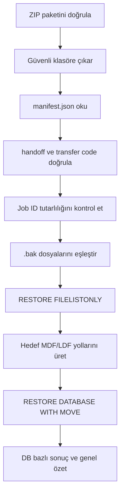
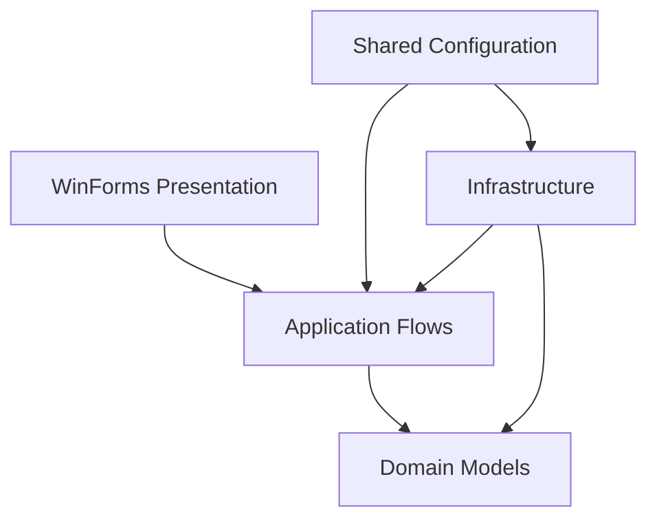

# Orka Migration Assistant — Teknik Vaka Çalışması

> ORKA kullanılan Windows ortamlarında SQL Server taşıma operasyonunu; kaynak doğrulama, toplu backup, paketleme, hedef hazırlama ve kontrollü restore adımlarıyla standartlaştıran .NET masaüstü uygulaması.

[Mimari](docs/architecture.md) · [Migration Akışı](docs/migration-workflow.md) · [Doğrulama ve Sınırlar](docs/verification-and-limitations.md)

## Kısa Bakış

Orka Migration Assistant, ana bilgisayar değişiminde tekrar eden ve hata riski taşıyan SQL Server operasyonlarını tek bir operatör akışında toplar.

Uygulama kaynak makinede doğru SQL instance'ını doğrular, kullanıcı veritabanlarını bulur, toplu backup alır ve taşınabilir bir migration paketi üretir. Hedef makinede SQL Server kurulumunu otomatikleştirir; paket, manifest ve handoff verilerini doğruladıktan sonra veritabanlarını hedef instance'a restore eder.

Bu depo, private olarak geliştirilen ürünün kaynak kodunu veya operasyonel sırlarını paylaşmadan mimari kararlarını, uygulanan iş akışlarını ve mevcut sınırlarını sunar.

## Problem

Bir muhasebe uygulamasının ana bilgisayarını değiştirmek yalnızca `.bak` dosyalarını kopyalamaktan ibaret değildir. Operasyon sırasında şu risklerin birlikte yönetilmesi gerekir:

- Yanlış SQL instance'ına bağlanılması
- Sistem veritabanlarının yanlışlıkla migration kapsamına alınması
- Birden fazla veritabanında eksik veya yarım backup oluşması
- Backup dosyaları ile metadata'nın birbirinden kopması
- Hedef SQL Server'ın yanlış feature, collation veya authentication ayarlarıyla kurulması
- Kaynak ve hedef operasyonlarının aynı migration işiyle eşleştirilememesi
- Eski fiziksel MDF/LDF yollarının yeni makinede geçersiz olması
- Hangi veritabanının başarıyla restore edildiğinin izlenememesi

Orka Migration Assistant bu dağınık adımları izlenebilir, tekrar edilebilir ve operatör kontrollü bir pipeline'a dönüştürür.

## Uçtan Uca Akış

İş akışı iki kontrollü fazdan oluşur:

1. **Source migration:** doğrulama, discovery, backup, manifest, package ve transfer code üretimi
2. **Target migration:** SQL kurulumu/doğrulaması, package extraction, metadata kontrolü ve database restore

Fiziksel transfer bilinçli olarak operatör kontrolündedir; uygulama FTP, e-posta veya bulut aktarımı yaptığını iddia etmez.

## Uygulanan Yetenekler

| Alan | Uygulanan yaklaşım | Sağladığı değer |
|---|---|---|
| Instance doğrulama | Beklenen named instance ve SQL metadata kontrolü | Yanlış sunucuda işlem riskini azaltır |
| Veritabanı keşfi | User database listesi ve system database filtresi | Migration kapsamını güvenli biçimde sınırlar |
| Backup orchestration | Veritabanı bazlı durum takibiyle sıralı toplu backup | Çoklu şirket/veritabanı operasyonunu standartlaştırır |
| Operasyon klasörü | Her iş için ayrı çıktı dizini | Dosya ve logların birbirine karışmasını önler |
| Manifest | Job ve backup item metadata'sını JSON olarak üretir | Paketin içeriğini makine tarafından okunabilir hale getirir |
| Paketleme | Backup klasörünü tek ZIP çıktısında toplar | Kontrollü fiziksel taşımayı kolaylaştırır |
| Handoff | Migration job ID ve transfer code üretir | Kaynak ile hedef akışını aynı operasyon altında bağlar |
| SQL kurulumu | Config tabanlı silent setup ve exit-code takibi | Hedef makine hazırlığını tekrar edilebilir hale getirir |
| Fail-fast pipeline | Kurulum, instance doğrulama ve bağlantı kontrolü | Başarısız adım sonrasında riskli devamı engeller |
| Güvenli extraction | Hedef dışına çıkışı engelleyen Zip-Slip path kontrolü | Zararlı veya bozuk archive path'lerine karşı koruma sağlar |
| Metadata doğrulama | Manifest, handoff, transfer code ve job ID tutarlılığı | Yanlış paketin restore edilmesini önlemeye yardımcı olur |
| Restore hazırlığı | `RESTORE FILELISTONLY` ve hedef data/log dizini çözümleme | Eski fiziksel yolları hedef makineye taşımayı önler |
| SQL restore | `WITH MOVE`, çoklu data/log dosyası ve kontrollü `REPLACE` | Farklı makine dizinlerinde gerçek restore yapılmasını sağlar |
| Operatör deneyimi | Async WinForms ekranları, progress ve reusable result panel | Uzun süren işlemlerde UI'ın kullanılabilir kalmasını sağlar |
| İzlenebilirlik | Serilog ve adım/veritabanı bazlı sonuç modelleri | Hata analizi ve operasyon özeti üretir |

## Restore Pipeline

Restore sırasında mevcut bir veritabanı bulunursa bağlantılar kontrollü biçimde sonlandırılır, veritabanı `SINGLE_USER` durumuna alınır ve restore sonrasında `MULTI_USER` durumuna döndürülür. Her veritabanı için ayrı başarı/başarısızlık sonucu üretilir; genel akış tamamlandı, kısmen tamamlandı, başarısız veya iptal edildi durumlarını ayırt eder.

## Mimari Yaklaşım

- **Domain:** backup, installer, handoff ve restore durumları ile sonuç modelleri
- **Application:** UI'dan bağımsız flow ve service sözleşmeleri
- **Infrastructure:** SQL, filesystem, ZIP, process ve logging implementasyonları
- **Presentation:** Dependency Injection üzerinden application flow'larını kullanan WinForms arayüzü
- **Shared:** strongly typed connection, backup ve installer configuration modelleri

Business orchestration form event'lerine gömülmez. Aynı source, installer ve restore akışları presentation katmanından bağımsız olarak çağrılabilir.

## Teknoloji ve Araçlar

`C#` · `.NET 9` · `WinForms` · `Microsoft.Data.SqlClient` · `SQL Server 2019/2022` · `Microsoft.Extensions.Hosting` · `Dependency Injection` · `Options Pattern` · `Serilog` · `System.Text.Json`

## Benim Rolüm

Projeyi uçtan uca tasarlayıp geliştiriyorum. Sorumluluk alanlarım:

- operasyon problemini teknik akışlara ayırma,
- katmanlı solution ve dependency sınırları,
- SQL instance validation ve database discovery,
- backup, manifest, packaging ve handoff orchestration,
- silent SQL Server installation pipeline,
- package ve metadata validation,
- SQL restore ve fiziksel file relocation stratejisi,
- WinForms operatör arayüzü ve reusable result panel,
- structured logging ve sonuç modelleri,
- GitHub issue/task ve branch tabanlı geliştirme süreci.

## Proje Durumu

**Durum:** MVP / aktif geliştirme

Güncel geliştirme sürümü source migration, target preparation ve target restore hattını uçtan uca kod seviyesinde tamamlar. Daha geniş gerçek müşteri kullanımı öncesinde otomatik test kapsamı, credential yönetimi, package integrity doğrulaması ve kontrollü release süreci güçlendirilmelidir.

Ayrıntılı kanıt ve dürüst kapsam ayrımı için [Doğrulama ve Sınırlar](docs/verification-and-limitations.md) belgesine bakabilirsiniz.

## Depo Hakkında

Bu repository yalnızca teknik vaka çalışması ve mimari dokümantasyon içerir. Ürün kaynak kodu, gerçek müşteri verileri, SQL kimlik bilgileri, şirket içi yollar ve kurulum medyaları private tutulmaktadır.

---

**Geliştirici:** [Ekrem Güngör](https://github.com/Ekrem-Gungor)  
**LinkedIn:** [linkedin.com/in/ekrem-güngör](https://www.linkedin.com/in/ekrem-güngör)
