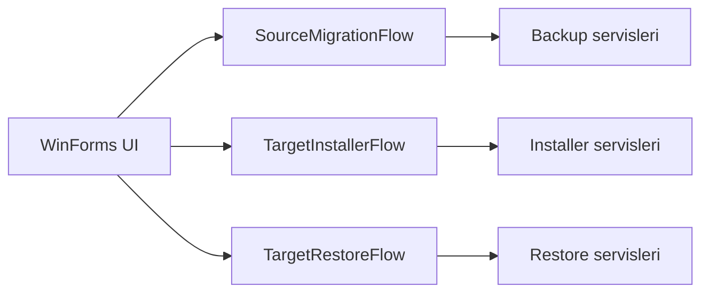
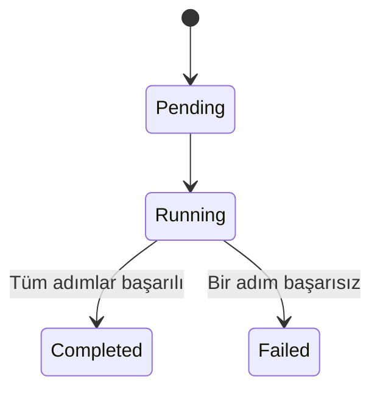

# Mimari Notlar

## Tasarım Hedefleri

Mimari aşağıdaki hedefler etrafında şekillendi:

1. SQL ve filesystem detaylarını iş akışından ayırmak.
2. Console prototipinde doğrulanan flow'ları WinForms'a kod tekrarı olmadan taşımak.
3. Uzun süren backup, setup ve restore işlemlerini async/cancellable çalıştırmak.
4. Her operasyon adımını strongly typed sonuçlarla raporlamak.
5. Kaynak ve hedef makine arasındaki manuel transferi metadata ile izlenebilir kılmak.

## Katmanlar

| Katman | Sorumluluk |
|---|---|
| Domain | `BackupJob`, `InstallerJob`, status enum'ları, manifest/handoff ve result modelleri |
| Application | Flow orchestration sözleşmeleri ve SQL/filesystem abstraction'ları |
| Infrastructure | SQL Client, backup/restore komutları, ZIP, JSON, process execution ve Serilog |
| Presentation | WinForms shell, source/installer/restore ekranları ve ortak result paneli |
| Shared | Strongly typed connection, installer ve output configuration |

Bağımlılıkların merkezinde Domain ve Application bulunur. Presentation doğrudan SQL komutu üretmez; flow servislerini Dependency Injection üzerinden çağırır.

## Flow Kompozisyonu

Bu yapı UI'ın yalnızca input toplamasını, loading state yönetmesini ve sonuç göstermesini sağlar. İş adımları yeniden kullanılabilir flow sınıflarında kalır.

## Domain Durumları

Backup ve installer operasyonları job + item/step yaklaşımıyla modellenir.

Restore ise birden çok veritabanı sonucu ürettiği için genel akışta dört son durumu ayırt eder:

- Completed
- PartiallyCompleted
- Failed
- Cancelled

## Yapılandırma

SQL bağlantısı, installer feature'ları, instance adı, collation ve output dizinleri strongly typed Options modelleriyle temsil edilir. Bu yaklaşım magic string'leri azaltır ve kurulum komutunun tek bir yapılandırma kaynağından üretilmesini sağlar.

Gerçek credential ve kurulum yolları public dokümantasyonun parçası değildir. Daha geniş dağıtım öncesinde secret'ların güvenli bir yerel veya merkezi credential store'a taşınması gerekir.

## Operasyonel Gözlemlenebilirlik

Serilog; source migration, installer ve restore yaşam döngüsünü dosya ve console sink'lerine yazar. Sonuç modelleri ayrıca UI için özet üretir:

- job/step status,
- hata mesajı,
- başlangıç/bitiş ve süre,
- package ve output path,
- database bazlı restore sonucu,
- toplam/başarılı/başarısız adetleri.

Loglar teknik tanı içindir; kullanıcıya sunulan ResultPanel ise operatör kararını kolaylaştıran seçilmiş summary ve durum mesajlarını gösterir.
