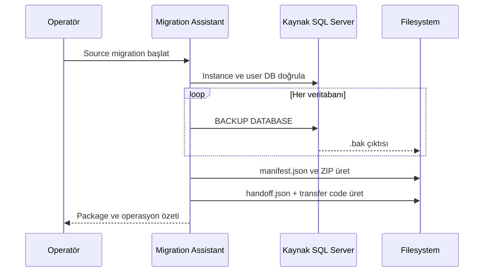

# Migration İş Akışı

## 1. Source Migration

Source flow aşağıdaki servisleri sıralı biçimde orkestre eder:

1. Beklenen SQL named instance'ını doğrula.
2. User database listesini al; system database'leri dışarıda bırak.
3. Migration job için izole output/backup dizini oluştur.
4. Her veritabanının backup'ını al ve item durumunu kaydet.
5. Job ve backup item metadata'sından `manifest.json` üret.
6. Backup dizinini ZIP paketi haline getir.
7. Transfer code ve `handoff.json` üret.
8. Paket, manifest ve handoff bilgilerini operatöre göster.

## 2. Target Preparation

Hedef hazırlama pipeline'ı adım bazlı ve fail-fast çalışır:

1. Yapılandırmadan SQL Server silent setup komutunu üret.
2. Setup process'ini başlat; stdout, stderr ve exit code'u yakala.
3. Beklenen instance'ın oluştuğunu SQL metadata üzerinden doğrula.
4. Yapılandırılan SQL authentication bağlantısını doğrula.
5. Her adımın durum ve süresini özetle.

Bir adım başarısız olursa sonraki adım çalıştırılmaz. SQL kurulum medyasını internetten indirme bu pipeline'ın kapsamı dışındadır; onaylı setup kaynağı operatör tarafından sağlanır.

## 3. Handoff ve Fiziksel Transfer

Handoff metadata'sı kaynak ve hedef akışını aynı job altında bağlar:

- transfer code,
- backup job ID,
- source server ve instance,
- package adı/boyutu,
- manifest yolu,
- handoff status.

Uygulama otomatik ağ/bulut transferi yapmaz. Paket ve handoff çıktılarının hedef makineye ulaştırılması operatörün kontrollü adımıdır.

## 4. Target Restore

Restore flow aşağıdaki güvenlik ve tutarlılık kontrollerini uygular:

1. Server, ZIP path ve transfer code input'larını doğrula.
2. ZIP entry'lerini normalize ederek hedef dizin dışına çıkışı engelle.
3. `manifest.json` dosyasını bul, deserialize et ve zorunlu alanlarını doğrula.
4. `handoff.json` dosyasını bul; transfer code ve izin verilen handoff durumunu doğrula.
5. Manifest JobId ile handoff BackupJobId değerini karşılaştır.
6. Manifest item'larını extract edilmiş `.bak` dosyalarıyla eşleştir.
7. Her backup için `RESTORE FILELISTONLY` çalıştır.
8. Hedef SQL Server'ın default data/log dizinlerini çöz.
9. Logical file listesinden hedef MDF/NDF/LDF yollarını üret.
10. Veritabanı varsa `SINGLE_USER WITH ROLLBACK IMMEDIATE` uygula.
11. `RESTORE DATABASE ... WITH MOVE` ve gerektiğinde `REPLACE` çalıştır.
12. Restore sonrasında veritabanını `MULTI_USER` durumuna getir.
13. Veritabanı bazlı sonuçları ve genel operasyon özetini göster.

## 5. Hata ve İptal Davranışı

- Input ve metadata hataları SQL restore başlamadan döner.
- Bir backup dosyası eşleşmezse o veritabanı failure sonucu üretir; diğer item'lar değerlendirilmeye devam eder.
- SQL hataları database result'a dönüştürülür ve loglanır.
- UI kapanırken aktif CancellationToken iptal edilir.
- Mevcut veritabanı restore sırasında tek kullanıcı moduna alınır; `finally` bloğunda tekrar çoklu kullanıcı moduna döndürülmeye çalışılır.

Bu davranış kısmi başarıyı görünür kılar; “bazı veritabanları restore edildi” durumu tam başarı olarak raporlanmaz.
